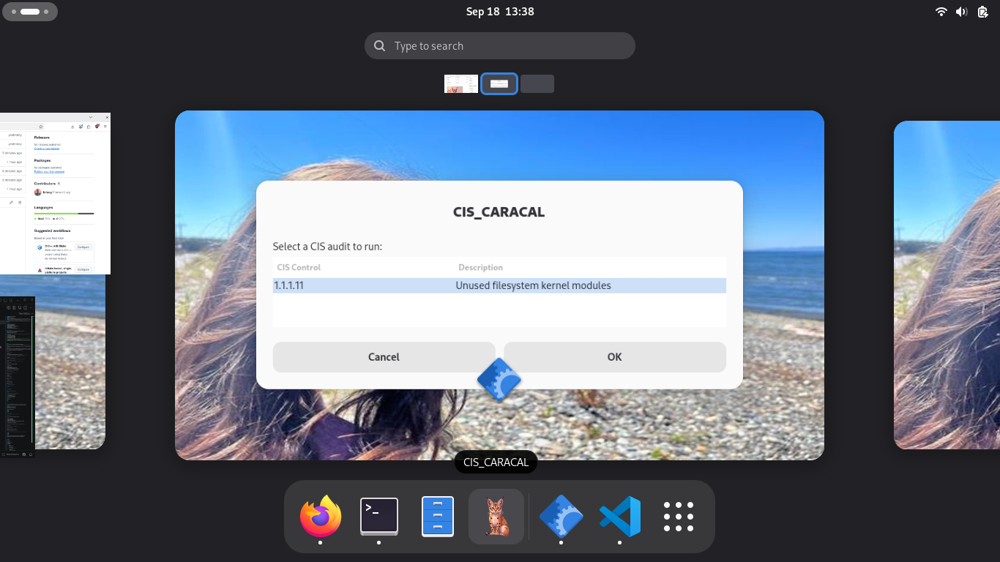

\
\
# CIS_CARACAL

**Debian 13 CIS Security Auditor**

CIS_CARACAL is a lightweight cybersecurity auditing tool for Debian Linux systems. It provides both a command-line interface (CLI) and a graphical interface (GUI) for performing selected security checks based on the **Center for Internet Security (CIS) Debian Linux Benchmark**.

The project is designed as a proof-of-concept cybersecurity auditing application, demonstrating Linux security auditing, C programming, Bash scripting, process management, Debian packaging, and basic desktop integration.

---

## Features

* Command-line security auditing interface
* Graphical interface using Zenity
* CIS Benchmark-based security checks
* Bash-based system auditing engine
* C-based CLI application and process orchestration
* Debian `.deb` package
* Installs CLI globally as `cis_caracal`
* GNOME application launcher integration
* Desktop application icon
* Uses standard Debian/Linux system utilities
* No external web service or cloud infrastructure required

---

## Current CIS Audit

### CIS 1.1.1.11 — Ensure unused filesystems kernel modules are not available

**Benchmark:** CIS Debian Linux 13 Benchmark
**Profile:** Level 1 — Server and Workstation
**Assessment Type:** Manual

This audit checks filesystem kernel modules against the filesystem types currently in use by the system.

The audit examines:

1. Currently mounted filesystem types
2. Available filesystem kernel modules
3. Currently loaded filesystem modules
4. Kernel module loading configuration
5. Blacklisted modules
6. Modules configured as non-loadable
7. The relationship between filesystem modules currently in use and modules that are available or loaded

The audit produces a report describing the current system state.

> **Important:** CIS_CARACAL is currently a proof-of-concept implementation covering a selected CIS control. It should not be interpreted as a complete CIS compliance scanner or as a replacement for an official CIS Benchmark assessment.

---

### CLI

The CLI is written in C and provides the main menu and process management.

When an audit is selected, the C application launches the corresponding Bash audit script using a child process.

The C application does not duplicate the system-auditing logic. Instead, it acts as the application front end and orchestrator.

### GUI

The GUI uses **Zenity** to provide a lightweight graphical interface without requiring a full GTK application.

The GUI and CLI both use the same underlying Bash audit engine. This keeps the auditing logic centralized and avoids maintaining separate implementations of the same security check.

---

## Requirements

CIS_CARACAL is intended for:

* Debian 13
* x86-64 / `amd64`
* Linux systems using the standard Debian module and filesystem layout
* GNOME or another desktop environment capable of launching `.desktop` applications for the GUI

The packaged application installs the required runtime dependencies automatically.

---

# Installation

## Option 1 — Install the Debian Package

Download or clone the project repository, then navigate to the project directory.

Build the Debian package if necessary:

```bash
dpkg-deb --build --root-owner-group package cis-caracal_0.1.0_amd64.deb
```

Install the package:

```bash
sudo apt install ./cis-caracal_0.1.0_amd64.deb
```

The package installs:

```text
/usr/bin/cis_caracal
/usr/bin/cis_caracal_gui
/usr/lib/cis_caracal/scripts/cis_1_1_1_11.sh
/usr/share/applications/cis_caracal.desktop
/usr/share/icons/hicolor/256x256/apps/cis_caracal.png
```

After installation, the CLI is available system-wide.

---

## Verify the Installation

Verify that the CLI is available in your shell:

```bash
command -v cis_caracal
```

Expected output:

```text
/usr/bin/cis_caracal
```

Verify the GUI launcher:

```bash
command -v cis_caracal_gui
```

Expected output:

```text
/usr/bin/cis_caracal_gui
```

Verify the audit engine:

```bash
ls -l /usr/lib/cis_caracal/scripts/
```

The directory should contain:

```text
cis_1_1_1_11.sh
```

---

# Using CIS_CARACAL

## Command-Line Interface

Launch the CLI from any normal terminal:

```bash
cis_caracal
```

The application displays the available CIS audits:

```text
========================================
           CIS_CARACAL
      Debian 13 Security Auditor
========================================

1. CIS 1.1.1.11 - Unused filesystem
   kernel modules

0. Exit

Select an option:
```

Enter:

```text
1
```

to run the CIS 1.1.1.11 audit.

The Bash audit engine performs the system checks and returns the audit output to the CLI.

The C application interprets the audit's exit status and displays the resulting status:

```text
========================================
 Audit Result
========================================
RESULT: PASS
========================================
```

Possible result states include:

* `PASS`
* `FAIL`
* `WARNING`
* `ERROR`

---

## Graphical Interface

The GUI can be launched directly from a terminal:

```bash
cis_caracal_gui
```

It can also be launched through the desktop environment.

In GNOME:

1. Open the application menu.
2. Search for **CIS_CARACAL**.
3. Launch the application.
4. Select the CIS audit from the list.
5. Review the generated audit report.

The application is installed using the standard desktop application mechanism:

```text
/usr/share/applications/cis-caracal.desktop
```

After launching it, the application can also be added to the GNOME favorites/dock.

---

# Audit Engine

The system-level auditing logic is implemented in:

```text
scripts/cis_1_1_1_11.sh
```

When installed, the audit script is located at:

```text
/usr/lib/cis_caracal/scripts/cis_1_1_1_11.sh
```

The script uses standard Linux utilities to inspect the system, including tools such as:

* `findmnt`
* `find`
* `lsmod`
* `modprobe`
* `grep`
* `sort`

The audit is read-only and is intended to inspect the current system configuration.

**CIS_CARACAL does not automatically modify the system or apply remediation.**

---

# Project Structure

```text
CIS_CARACAL/
│
├── src/
│   └── main.c
│
├── scripts/
│   └── cis_1_1_1_11.sh
│
├── package/
│   ├── DEBIAN/
│   │   └── control
│   │
│   └── usr/
│       ├── bin/
│       │   ├── cis_caracal
│       │   └── cis_caracal_gui
│       │
│       ├── lib/
│       │   └── cis_caracal/
│       │       └── scripts/
│       │           └── cis_1_1_1_11.sh
│       │
│       └── share/
│           ├── applications/
│           │   └── cis_caracal.desktop
│           │
│           └── icons/
│               └── hicolor/
│                   └── 256x256/
│                       └── apps/
│                           └── cis_caracal.png
│
├── cis_caracal_gui.sh
├── cis_caracal.png
├── CONTRIBUTIONS.md
├── LICENSE
├── README.md
└── .gitignore
```

---

# Development

## Clone the Repository

```bash
git clone <repository-url>
cd CIS_CARACAL
```

Development work is performed on the `dev` branch.

The project's Git workflow uses two branches:

```text
dev -> Pull Request -> main
```

Changes should be developed and tested on `dev` before being merged into `main`.

See [`CONTRIBUTIONS.md`](CONTRIBUTIONS.md) for the project's contribution and Git workflow.

---

## Compile the CLI

For development, the C application can be compiled with:

```bash
gcc -Wall -Wextra -std=c17 src/main.c -o cis_caracal
```

Run the development build with:

```bash
./cis_caracal
```

The development build uses the repository-relative audit script:

```text
./scripts/cis_1_1_1_11.sh
```

The packaged build uses the installed audit location:

```text
/usr/lib/cis_caracal/scripts/cis_1_1_1_11.sh
```

This separation allows the same source code to work both during development and after installation.

---

# Building the Debian Package

The package staging directory contains the final filesystem layout that will be installed on the target system.

The packaged CLI is compiled with the installed audit path:

```bash
gcc -Wall -Wextra -std=c17 \
-D'AUDIT_SCRIPT="/usr/lib/cis_caracal/scripts/cis_1_1_1_11.sh"' \
src/main.c \
-o package/usr/bin/cis_caracal
```

Ensure the executables and audit script are executable:

```bash
chmod 755 package/usr/bin/cis_caracal
chmod 755 package/usr/bin/cis_caracal_gui
chmod 755 package/usr/lib/cis_caracal/scripts/cis_1_1_1_11.sh
```

Build the Debian package:

```bash
dpkg-deb --build --root-owner-group package cis-caracal_0.1.0_amd64.deb
```

Inspect the package contents:

```bash
dpkg-deb --contents cis-caracal_0.1.0_amd64.deb
```

Inspect package metadata:

```bash
dpkg-deb --info cis-caracal_0.1.0_amd64.deb
```

Install the resulting package:

```bash
sudo apt install ./cis-caracal_0.1.0_amd64.deb
```

---

# Uninstallation

CIS_CARACAL can be removed through `apt`:

```bash
sudo apt remove cis-caracal
```

To remove the package and its configuration files, if any are present:

```bash
sudo apt purge cis-caracal
```

---

# Security Considerations

CIS_CARACAL is designed to perform security auditing without automatically changing system configuration.

The current audit is intended to inspect:

* Mounted filesystem types
* Filesystem kernel modules
* Loaded kernel modules
* Kernel module loading configuration
* Blacklist configuration
* Module installation rules

The project deliberately does **not** automatically disable kernel modules or modify `/etc/modprobe.d/`.

This approach allows the audit results to be reviewed before any administrative remediation is performed.

---

# Limitations

CIS_CARACAL is currently a proof-of-concept project and has several limitations.

### Limited CIS coverage

Only one CIS Benchmark control is currently implemented:

```text
CIS 1.1.1.11
Ensure unused filesystems kernel modules are not available
```

Additional CIS controls may be added in future versions.

### Debian-specific implementation

The current implementation targets Debian 13 and its Linux filesystem/module layout.

Other distributions may use different:

* Kernel module locations
* Package names
* Configuration paths
* System utilities
* Filesystem configurations

### Manual CIS assessment considerations

The CIS control includes manual assessment considerations. CIS_CARACAL automates portions of the information-gathering process but should not be considered a complete automated replacement for the CIS Benchmark assessment process.

### Proof-of-concept status

The project is intended to demonstrate cybersecurity auditing concepts and software development practices. It is not currently intended to serve as an enterprise compliance platform.

---

# Technologies

CIS_CARACAL uses:

* **C** — CLI application and process orchestration
* **Bash** — system-level auditing logic
* **Zenity** — graphical interface
* **GCC** — C compilation
* **Debian packaging tools** — `.deb` package creation
* **Linux system utilities** — system inspection
* **Git / GitHub** — source control and project management

---

# License

CIS_CARACAL is distributed under the license included in the [`LICENSE`](LICENSE) file.

---

# Author

**Finnian Lucy**

CIS_CARACAL was developed as a cybersecurity portfolio project demonstrating practical Linux security auditing, C programming, Bash scripting, Debian packaging, and secure software-development concepts.
